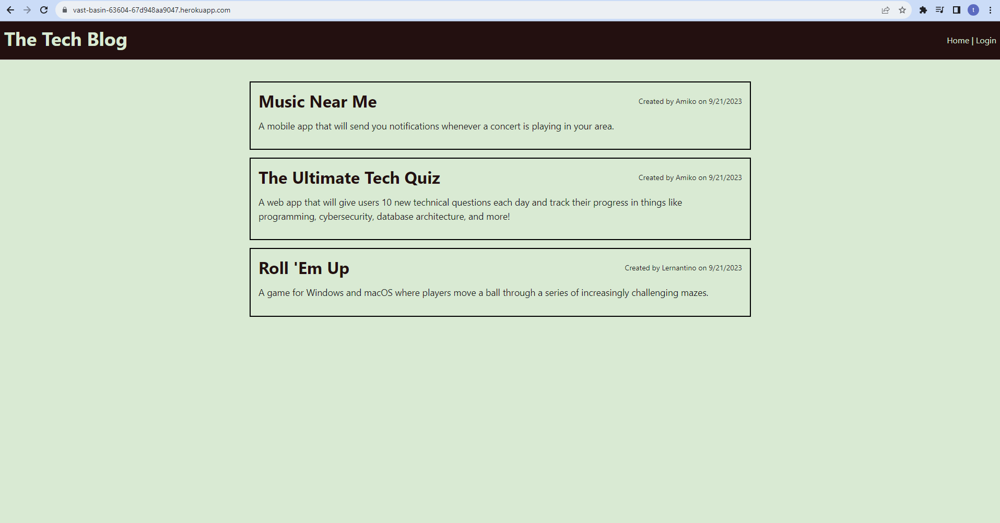

# 14 Model-View-Controller (MVC): Tech Blog

## Deployed Website Link

https://vast-basin-63604-67d948aa9047.herokuapp.com/

## Description

This is the 14th Module project for the 14th week of the UCB Coding bootcamp, this week we used a culmination of all the skills we've learned of sql database management and routing, password authenticators and hashers, and etc. to create a Tech Blog website where people can create an account to create, edit, or delete their own posts, or leave comments under other's posts. 

## Table of Contents
- [Description](#description)
- [WebsiteSS](#Screenshot)
- [Installation](#installation)
- [Usage](#usage)
- [License](#license)
- [Tests](#tests)
- [Questions](#questions)

## Screenshot 

## Installation

No installation required.

## Usage 

On the deployed website link, and you will start on the homepage where the most recent blog posts are shown. Press login to be prompted to either login or sign up, and you will then gain the dashboard tab, where you can create, edit, or delete your very own blog posts. 

## Tests

N/A
## Questions

For any questions, reach out to [notUnEeVeN](https://github.com/notUnEeVeN) or [email me](mailto:tybalt.mallet@gmail.com).
